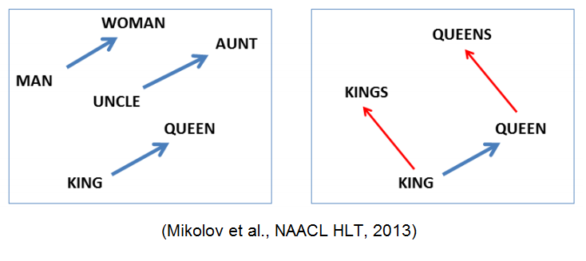

# Word2Vec Analogies Dataset Creation

This folder contains the scripts used to create our Word2Vec Analogies dataset. 

The analogies test created by Google asks us to solve a set of analogies of the form: "A is to B as C is to what?" For example, "Athens is to Greece as Baghdad is to what?" If the system returns "Iraq," then it has answered correctly.

To perform this task, we take advantage of Google's pre-trained word2vec model, a set of word vectors where semantic and syntactic relationships are preserved across the vector space. 

In `create_dataset_files.py`, we load the Google model, load a [dataset of sample analogies](http://download.tensorflow.org/data/questions-words.txt) of the form "A B C D," fetch the word vectors for A, B, and C from the model and use these to compute a new query vector. 

Specifically, we construct a query vector that's the average of B, C, and -A, and then normalize this vector.

`query = (B + C - A) / 3`

`query = query / norm(query)`

Next, in order to use this dataset on the Nearist appliances, we map the floating point query and word vectors into n-bit integers in the `map_to_uint8.py` script

Finally, on a Nearist appliance we will look through all of the word vectors in our word2vec model and find the closest matching word to our query vector (excluding words A, B, and C); this word vector should correspond to the "D" in the original analogy.

## Data Transformation

The normal distribution motivates us to try a logistic mapping function. We calculate the saturation point for the values as 8 x the standard deviation of the values. This means that any point farther than 8 standard deviations from the mean will be mapped to 0 (for negative numbers) or 255 (for positive numbers).

## Files
	
<table>
  <tr>  <th>File</th>                          <th>Description</th>  </tr>
  <tr>  <td>create_dataset_files.py</td>   <td>Loads word2vec model, loads analogies dataset, computes and saves query vectors for each analogy.</td>  </tr>
  <tr>  <td>map_to_uint8.py</td>            <td>Maps the floating point features to 8-bit integers and saves an integer copy of the datasets.</td>  </tr>
</table>  

## Requirements

To run these scripts, you will need Gensim installed. The pre-trained word2vec model and analogies dataset will need to be downloaded locally:

[Pretrained word2vec model](https://drive.google.com/file/d/0B7XkCwpI5KDYNlNUTTlSS21pQmM/edit)

[Dataset of analogies](http://download.tensorflow.org/data/questions-words.txt)

## Outputs

The `create_dataset_files.py` script outputs an HDF5 file `Google\_word2vec\_analogies.h5` containing the following datasets:

<table>
  <tr>  <th>Dataset</th>               <th>Dimensions</th>    <th>Component Size</th>   <th>Description</th>  </tr>
 
  <tr>  <td>query_vecs</td>   <td>~20,000 x 300</td>  <td>float</td>  <td>Computed query vectors.</td>    </tr>
  
  <tr>  <td>word_vecs</td>   <td>~3M x 300</td>  <td>float</td>  <td>Word vectors from model.</td>    </tr>
  
  <tr>  <td>abc_i</td>   <td>~20,000 x 3</td>  <td>string</td>  <td>First three words of each analogy.</td>    </tr>  
  
  <tr>  <td>d_i</td>   <td>~20,000 x 1</td>  <td>string</td>  <td>Solution word for each analogy.</td>    </tr>  
</table>

The `map_to_uint8.py` script outputs a ~900 MB HDF5 file `Google_word2vec_analogies_uint8_8std.h5` containing the following datasets:

<table>
  <tr>  <th>Dataset</th>               <th>Dimensions</th>    <th>Component Size</th>   <th>Description</th>  </tr>
 
  <tr>  <td>query_vecs</td>   <td>~20,000 x 300</td>  <td>int</td>  <td>Computed query vectors with integer components.</td>    </tr>
  
  <tr>  <td>word_vecs</td>   <td>~3M x 300</td>  <td>int</td>  <td>Word vectors from model with integer components.</td>    </tr>
  
  <tr>  <td>abc_i</td>   <td>~20,000 x 3</td>  <td>string</td>  <td>First three words of each analogy.</td>    </tr>  
  
  <tr>  <td>d_i</td>   <td>~20,000 x 1</td>  <td>string</td>  <td>Solution word for each analogy.</td>    </tr>  
</table>
